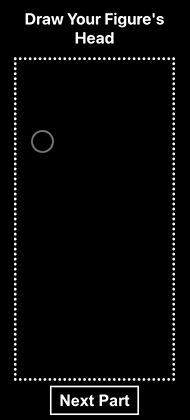
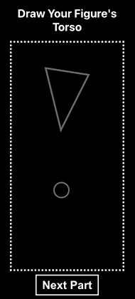
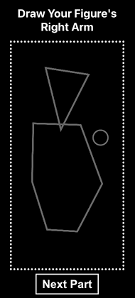
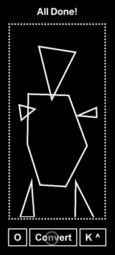

# CPSC 490: Senior Project

## Continuous Line Interpretation of User Drawn Polygons

_Documentation Last Updated: 11/11/22_

Codebase for my senior project for CPSC 490 at Yale University. Advised by Dr. Scott Petersen.

## Project Overview

## How to Run

### Prerequisites

The project requires that you have Node.js installed on your system. See installation instructions [here](https://nodejs.org/en/download/).

### Getting Set Up

Once you have Node installed, run the terminal commands below from the `cpsc490` directory:

```
~/cpsc490$ cd polygon-draw
~/cpsc490/polygon-draw$ npm install
```

This command will install all of the required dependencies for the project.

### Running the Program

Still working from the `cpsc490` directory, run the following commands:

```
~/cpsc490$ cd polygon-draw
~/cpsc490/polygon-draw$ npm start
```

Navigate to `localhost:3000` to observe the site and use.

## How to Use

### Inputting Polygons, Part by Part

  

The program accepts the polygons for the various body parts in stages to expand user control since they will be using their fingeres to draw the polygons.

As seen in the GIF above, users drag to draw lines (since this will translate well to a phone touchscreen interface) that form polygons. In order to close the polygon, they drag the last line to the initial point, and as long as the line's endpoint is within the white circle (within 20px radius of the initial point), the shape will be closed. The polygons are completely custom, in that they can have as many sides at whatever angle the user desires.

Once you finish the polygon, the system automatically places the shape where it would typically be on a body. When you click `Next Part`, you will be prompted to draw the next body part in the sequence.

### Converting to an Outline



Once the user has finished inputting all of the body parts, they will be oprompted to convert the figure into its concave hull counterpart. This outline shows up in blue, as seen above. The user can then increase the `k` value by pressing the `K^` button, which determines the concavity of the hull, to see what kind of figures will appear.

The user can also trigger their original polygonal figure to be displayed or not using the `O` button.

## Features In Progress

- [ ] Making the figures more human-discernable
- [ ] Cleaning up the code and making it more modular
- [ ] Create interface if the figure is a projector

## Dependencies

- [p5.js](https://p5js.org/)
- [hull.js](https://github.com/AndriiHeonia/hull)
- [Redux Toolkit](https://redux-toolkit.js.org/)
- [Sass](https://sass-lang.com/)
- Anything else installed with [create-react-app](https://create-react-app.dev/)
