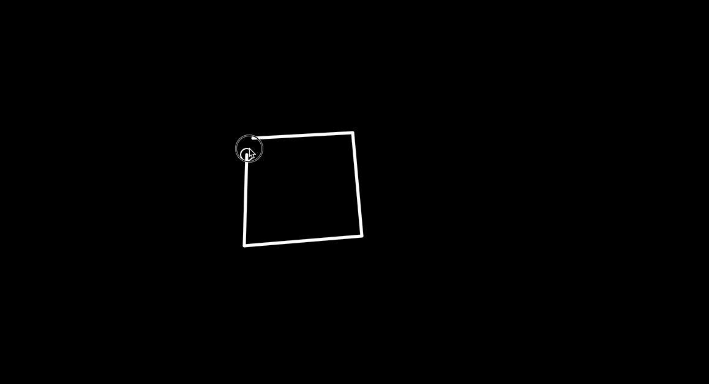

# CPSC 490: Senior Project

## Continuous Line Interpretation of User Drawn Polygons

_Documentation Last Updated: 10/7/22_

Codebase for my senior project for CPSC 490 at Yale University. Advised by Dr. Scott Petersen.

## Project Overview

## How to Run

In order to launch the server, I use the VSCode Live Server Extension. Instructions to install and run are found [here](https://www.freecodecamp.org/news/vscode-live-server-auto-refresh-browser/).

To get the application running on your desktop:

1. Open the `cpsc490` directory in VSCode
2. Press the `Go Live` button in the bottom right of your VSCode window
3. Your default browser should automatically open on `127.0.0.1:5500/` or whichever port you have configured your Liver Server to run on
4. See below `How to Use` section to interact with the program.

## How to Use

The program currently accepts user input in the form of drawn polygons using the p5.js library.

As seen in the GIF above, users drag to draw lines (since this will translate well to a phone touchscreen interface) that form polygons. In order to close the polygon, they drag the last line to the initial point, and as long as the line's endpoint is within the white circle (within 20px radius of the initial point), the shape will be closed.

The polygons are completely custom, in that they can have as many sides at whatever angle the user desires.

## Features In Progress

- Using a concave to create single line figures
  - To view progress on this, checkout the `concave_hull` branch.
  - Demo:

## Dependencies

- [p5.js](https://p5js.org/)
